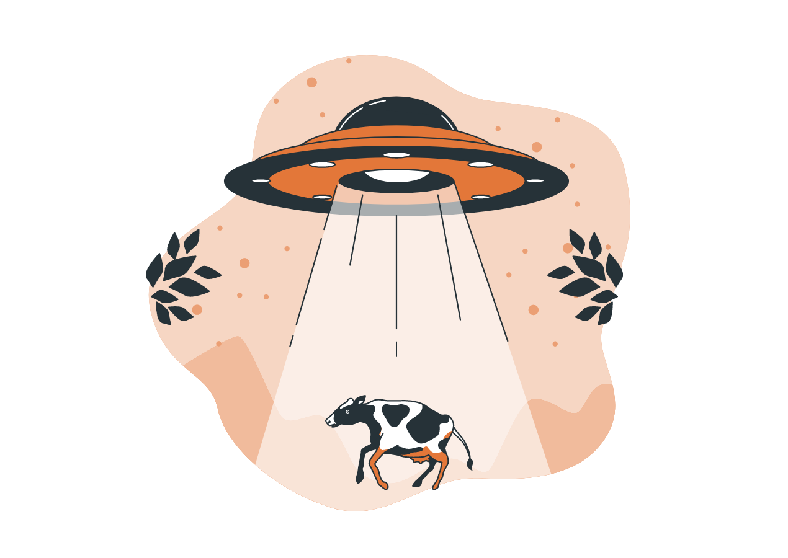

### COMBATING CATTLE RUSTLING WITH WAZIUP TECHNOLOGY

### LoRaWAN Collar
Low-Power, Long-Range and ready to use tracking device for livestock to increase farm profits and to prevent cattle rustling 

The WAZIUP cattle collar is an ideal solution for herdsmen to better protect their cattle. Our LoRa enabled device allows to locate herds in real-time and inform farmers about its position. The device can notify farmers about any abnormal condition; thereby farmers take necessary actions to search for their cattles, in order to reduce cattle theft, or loss. The solution is highly cost-effective, easy to install and maintain. 
 

### Technology Ecosystem

**How does it work?**
When collar is powered on, it sends GPS beacon every 10 minutes wirelessly using LoRa channel to our Gateway (up to 10kms); from the Gateway side, reception of beacon means that the cattle is in the range. If the device is out of range, disconnected or damaged, an alarm can be raised and sent to the farmer either from the Gateway or from the Cloud. Our LoRa Gateway sends the position to the Cloud platform via 3G or Ethernet connection ---with an easy to use interface the farmer gets information via SMS or on his Mobile App. Because of edge computing capabilities the data can also be accessed from the Gateway. The sensor is fully compatible with our technology ecosystem but it is also interoperable and open to integrate with other ecosystems. 

**Features**
- Embedded LoRa module 
- Integrated Tiny GPS sensor 
- Easy to install and maintain 
- Low-power, up to 1-year battery life 
- Communication up to 10 KMs
- Highly customizable solution 
- Packaging with farm management applications 

**LoRa:** We use narrowband IoT LoRa technology for a low-power and long-range communication without any dependency on WiFi or 3G. It is the best IoT wireless network for rural areas with no or poor Internet connectivity. 

**Waterproof box:** The electronics is placed in a watertight box to prevent from water and dust. 

**Power supply:** Our device is powered by 4-AA batteries for more than 1 year life time. 

**Easy setup and Installation:** Our devices are easy to setup and install with limited configuration  
 
