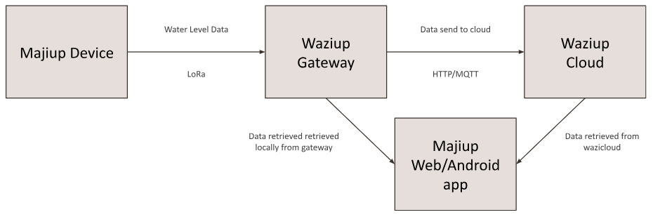
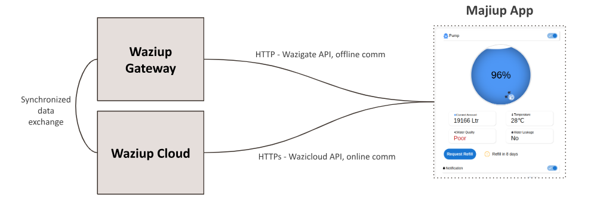

### Improving water management and distribution using technology



### Majiup

[Majiup](https://www.majiup.com) is a project revolutionizing how we manage our water storage facilities, while keeping the users connected to the water networks.

The solution is ideal for businesses, households, residential places and gated communities where they are able to track the amount of water they have consumed. From the Majiup platform, they can be able to order water from water vendors from our platform without aisle. This means that the storage faccilities never run dry. Majiup is powered by waziup LoRaWAN technology making the solution inexpensive, easy to maintain and install in remote areas.

### Technological architecture

Majiup solution run on waziup technologies. This encompasses the data collection and data relaying to the gateway. After installing the device on tanks, the wazisense v2.0 is responsible for collecting water level data at an interval of every five minutes. The data is then send to the gateway upto a range of 12km. The communication range depends on the area of deployment. In urban centers, the range is reduced to approximately 6 to 7 km while in rural areas, the distance can be a whopping 15km. The image below shows the architecture of the solution.

<!--  -->

The gateway hosts the Majiup application which shows the user interface for the application. This includes the following,

- Water levels in real time
- Water usage history
- Water usage analytics and trends
- Tank settings and configurations

The data collected on the gateway is synced to the cloud when the gateway receives an active internet connection. This step ensures that users can access the app all over the globe using the wazicloud platform. The syncronization of the gatewat to cloud is shown below.

<!--  -->

## Hardware overview

Majiup is powered by the following set of hardwares,

- Microcontroller - Wazisense v2.0
- Sensors - JSN-SR04T Ultrasonic sensor
- Power supply - Solar panel + 1 18650 Lithium Battery
- Gateway - Waziup Wazigate
- Casing - Majiup Waterproof Enclosure Casing
