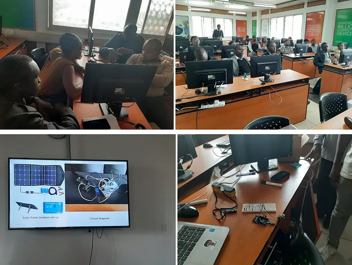

## WAZIHUB second Bootcamp Kenya with @ilabAfrica - Nov 22, 2019

@ilabAfrica, which is member of the network of Hubs build by Wazihub for IoT and Big Data innovation held its 2nd bootcamp
The second @iLabAfrica Wazihub bootcamp was held on the 15th to 18th October 2019 in Strathmore University premises. The 4 day bootcamp was a practical and classroom led training that engaged the participants to develop their ideas in the field of the Internet of Things (IoT) using the Waziup technology. This workshop was rich in diversity as it engaged different players in the industry including; Liquid Telecom, Strathmore University Business School, and the UN Habitat
**The theme of the 4 day workshop was on developing IoT solutions around Smart Cities.**

Smart cities use the different types of IoT sensors to collect data and then use the insights gained from that data to manage assets, resources and services efficiently. Data collected is processed and analyzed to monitor and manage traffic, transportation systems, waste management, crime detection, power plants among other services.
The participants were however not limited to developing their ideas around these themes. If any of them had a pressing idea, they were allowed to come up with an IoT solution around that.
The 2nd @iLabAfrica bootcamp had a total attendance of 17 participants. All of the 17 participants maintained attendance consistency for all the 4 days of the training.
At the end of the bootcamp, all of the participants were awarded certificates of participation. The judges were also awarded with certificates of appreciation.

### Day One — 27th July 2019
On the first day, after the introduction to the theme, presentation of the Wazihub program and the Waziup technology was given to the participants. Stephen Ngetich, a software developer and IoT specialist, gave an overview of IoT and its use cases in the various themes, including current working examples of the technology.

Participants were taken through simple practical session to demonstrate the hardware components of the Waziup toolkits and materials. After forming 5 different groups, assignment were given to them based on what they had learnt on Day 1.

Later in the afternoon was an industry visit to Liquid Telecom. Marvin Ngesa, an IoT engineer at Liquid Telecom gave several use cases of IoT at Liquid telecom. These were actual working solutions that have been implemented in small and large companies. This gave the participants an idea of the needs of IoT solutions in Kenya.

### Day Two — 28th July 2019
Trainers covered the basics of the hardware part of IoT. This included: Electronics Fundamentals and Breadboarding, IoT hardware Basics, Sensors, Nano LoRa Board.
In the afternoon, the LoRa network and Waziup communication was covered. These sessions involved all the participants as they were provided with all the devices they needed. Participants also began working on their ideas in their distinctive groups.



### Day Three — 29th July 2019
Day three activities started with gateway setup and configuration was also demonstrated. Demonstration was done on how to use the Waziup IoT cloud dashboard, develop simple HTML applications as well as full stack web applications. The day was filled with a lot of practical work and assignments. It also involved a lot of one on one between the participants and trainers.

### Day Four — 30th July 2019
This was the final day of the bootcamp. Margaret Njenga-Birir, project lead at @ilabAfrica presented the Wazihub accelerator program, its components and the next steps after the bootcamp. These include prototyping and growth hack stages. She highlighted the criteria for entering the prototyping stage by Wazihub participants and use of the incubation space at @iBizAfrica. @iBizAfrica is the incubation centre for @iLabAfrica.
Kamil Jeřábek from the Information Systems Security department of @iLabAfrica made a very insightful presentation about the role of emerging Technologies (Cyber Security, Machine Learning, Artificial Intelligence and Big Data) in IoT.

Wandji Ngongang Danude, an IoT Engineer based at the UN Habitat gave a presentation about the role of IoT projects in the UN Habitat. He expounded on the different use cases of IoT and how the technology can be used to solve challenges in each of their local environments.

The bootcamp also covered some aspects of business and entrepreneurship. Sylvia Filamoi from the Strathmore Business School delved into the topic of startups and successful business models. She covered Business Model Creation and demonstrated this through the Business Model canvas.

Every Group pitched their ideas and the winning team was Traffic Chap Chap, a smart traffic solutions that aims at reducing traffic congestion by: providing data for informed decisions to the police department, Rerouting of vehicles to less congested roads to prevent deadlocks, provide real time traffic data that can be processed and used for future planning, reduce air and sound pollution caused by stationary vehicles due to traffic. Each of the team members received a gift that included a set of different sensors.
