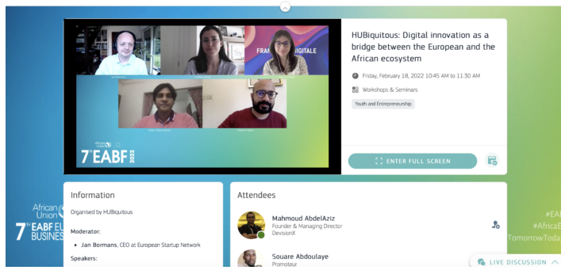

<!--  -->


## Dr. -Ing. Abdur Rahim Participates in 7th EU-Africa Business Forum, Discusses Digital Innovation

Dr. -Ing. Abdur Rahim, the project Coordinator of HUBiquitous, participated in the 7th EU - Africa Business Forum (EABF) from 14th to 18th, 2022. During the event, he was responsible for operating and managing our virtual booth at the digital trade fair, and also led a panel discussion focused on digital innovation that aimed to bridge European and African ecosystems. 
The EABF is a triennial event that brings together business organizations from both continents, co-organized by the European Union (EU) and the African Union Commission (AUC). The primary objective of the forum is to promote public - private dialogue between EU and African stakeholders, with the goal of expanding long - term economic collaboration. Due to the pandemic, the 7th EABF was mainly conducted online, featuring a range of high - level panels, workshops, and conferences throughout the week. 
