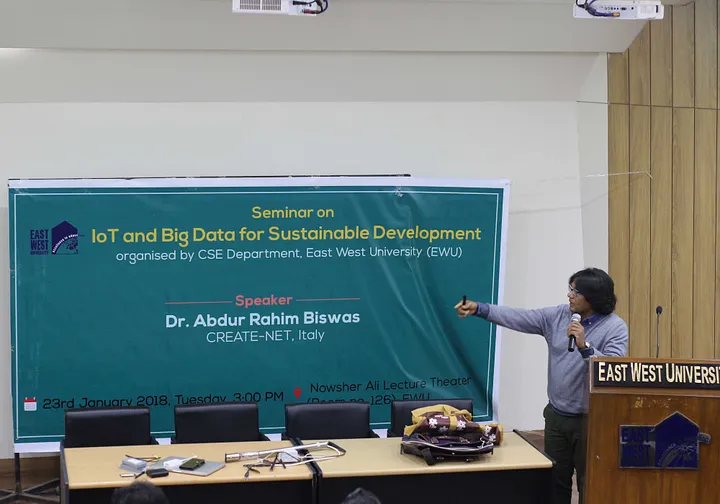

<!--  -->


## WAZIHUB Presented at East West University in Bangladesh

The Department of Computer Science and Engineering at East West University in Bangladesh held a seminar on January 23, 2018, focused on the theme 
"IoT and Big Data for Sustainable Development". The seminar was organized to increase awareness among students and faculty about the potential of
IoT and big data to contribute to sustainable development.

Dr. Abdur Rahim Biswas, a senior research staff member in the smart IoT group at CREATE-NET, Italy, and the project coordinator of WAZIHUB, was the
keynote speaker of the event. Dr. Biswas presented the Wazihub project and the Waziup technology to a group of around 100 students and faculty, who
attended the seminar and made it a success.

The seminar was chaired by Dr. Ahmed Wasif Reza, the Associate Professor and Chairperson of the CSE department. The event covered topics such as the
implementation of IoT for sustainable development, the role of big data in IoT, and how IoT can create new opportunities for economic growth.

During the seminar, Dr. Biswas discussed the potential of IoT and big data to address societal challenges and presented examples of how IoT can improve
healthcare, transportation, and environmental monitoring. He also emphasized the importance of innovation and collaboration in developing IoT solutions
that can promote sustainable development.

The seminar provided an opportunity for students and faculty to learn from a leading expert in the field and to exchange ideas on how to use IoT and big
data to address the challenges facing their communities. The event was a success, as it helped to raise awareness about the potential of IoT and big data
for sustainable development and promoted collaboration between academia and industry.
