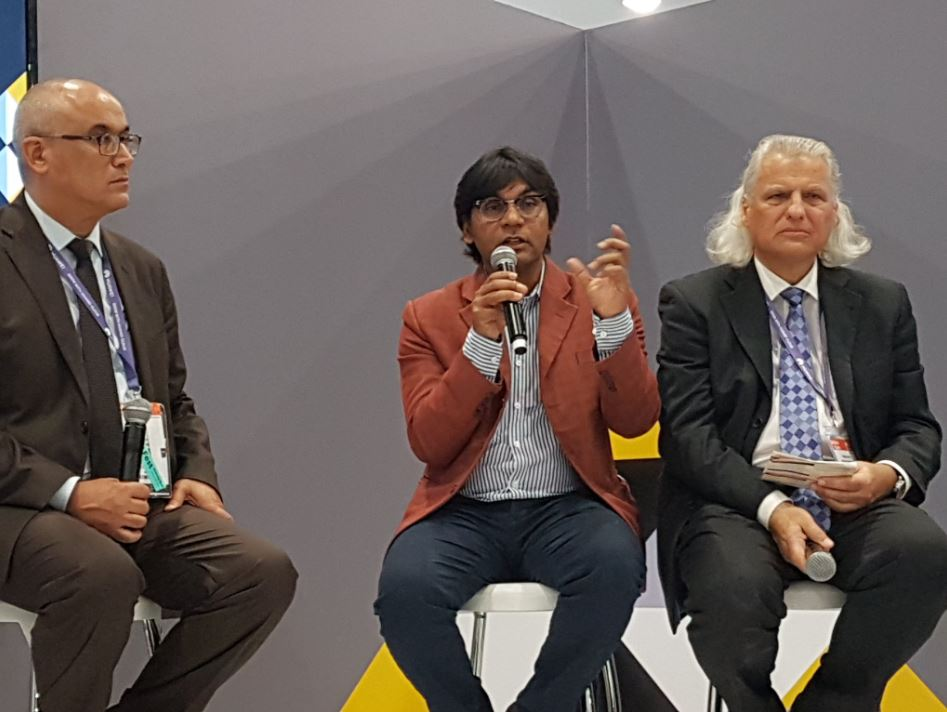

Waziup aims to bring IoT (Internet of Things) solutions to Africa. Waziup recently made an impact at the AHUB section of an event that celebrates the critical role of entrepreneurship in driving Africa’s digital economy forward. WAZIUP Team set up an eye-catching booth in the heart of the AHUB section, which attracted attention from investors and tech enthusiasts alike.
That wasn’t all. Waziup’s project coordinator, Dr. -Ing. Abdur Raim, also delivered a talk on ‘IoT made in Africa’ at the Internet of Things World Africa session which was followed by a Q&A session. The audience was captivated as Dr. Rahim shared his insights on how IoT solutions can benefit Africa and help overcome the continent’s unique challenges.
In addition to the talk, Dr. Rahim also participated in the keynote panel, which focused on the theme ‘The Digital Gold Mine : Overcoming Regional Obstacles.’ During the pencil, he spoke about the impact of digitalisation on production, management and governance in Africa, and discussed ways to overcome technological and economic barriers. Other speakers at the panel also talked about how to address these obstacles, making it a valuable discussion for attendees. 

Overall, Waziup’s presence and contribution at the AHUB section was a huge success.