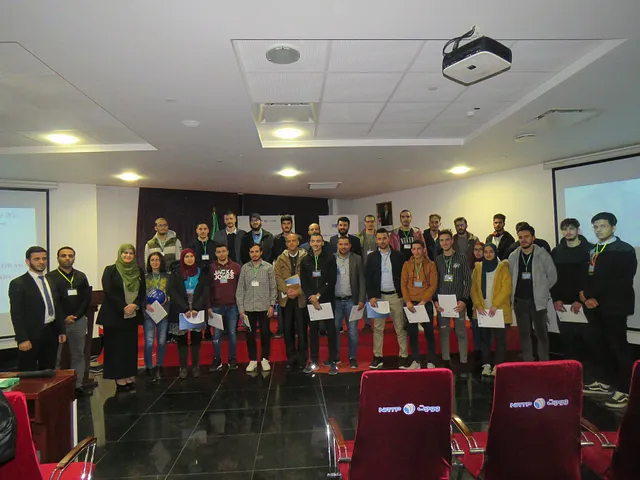

Waziup was commissioned by German Federal Ministry for Economic Affairs and Energy for an event dedicated to IoT & LoRaWan technologies held on December 16 and 17, 2019 at the Sidi Abdallah Technopark.
The two days events were organized by ANPT Cyberpark, the National Agency for the Promotion and Development of Technology Parks of Algeria.
Waziup was represented by Dr. Corentin Dupont and Sven Zeisberg who talked at a conference on LoRA and LoRaWAN in English the first day and in French the second day.
They presented the WAZIUP association, the LoRa and LoRaWAN technologies and participated in the panel discussion. A demo of the Waziup end-to-end technology was also presented.
The conference was quite successful and appreciated by participants as LoRa/LoRaWAN is an important and emerging topic. The audience was wide, with the presence of members from the National Agency of Frequencies (ANF), telecom operators and various companies.
The Hackathon was launched on the 16/12/2019. In the morning, a presentation of the WAZIUP platform showed the most popular IoT technologies and use cases. Particular focus was put on the LoRa and LoRaWAN radio networks. A demo of the technology was performed.
In the afternoon, teams were formed and coached by WAZIUP and ANPT colleagues and a Waziup LoRa gateway was set up to support the hackathon.
Seven teams presented their solutions in front of the audience of the conference. The use cases were on transportation, logistics, and health. 
The Jury then deliberated and selected three winners who will be incubated at ANPT. All teams were also given a “WaziDev”, which is a LoRa-Arduino experimentation development board.
