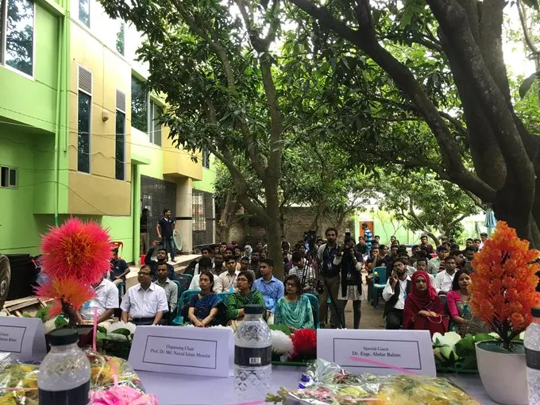

<!--  -->


## IoT Event in Bangladesh with Varendra University

In Bangladesh, there was an IoT idea contest held at Varendra University, which was organized through a collaboration between the EEE department and WAZIHUB and WAZIUP.

On August 1st, 2019, the Electrical & Electronic Engineering department at Varendra University organized a technical event called Technofrenzy 2019. This event was aimed at providing a platform for students to exhibit their talent and skills in a competitive setting. The inauguration of the IEEE student branch of VU marked the beginning of the event.
As part of Technofrenzy 2019, WAZIUP and WAZIHUB hosted a project showcasing and idea competition, which was open to all innovative IoT ideas. The top three ideas were awarded prizes such as Waziup development kits. The project coordinator, Abdur Rahim, also gave a talk about WAZIUP and WAZIHUB during the event.

In essence, Technofrenzy 2019 was a great opportunity for students to showcase their technical abilities and creative ideas. The collaboration with WAZIUP and WAZIHUB added an extra dimension to the event, providing students with access to industry experts and resources.
