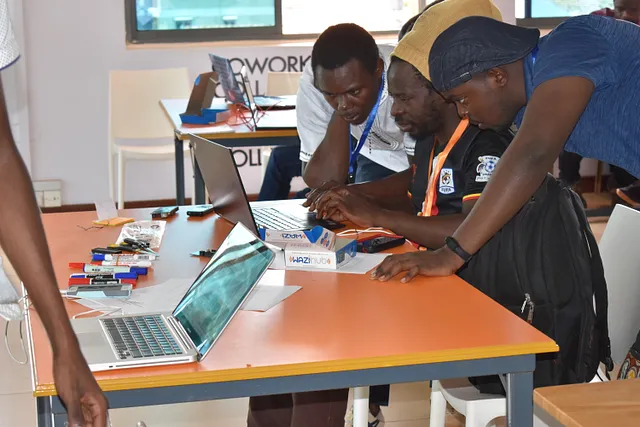

The Uganda chapter for Wazihub organized on October 26th & 27th October an IoT bootcamp that was focused on capacity building.

The sole goal of this bootcamp was to train more people on how to utilize the cost-effective Waziup technology while addressing the needs of African technical professionals/enthusiasts who might want to venture into IoT as a business. The two day Bootcamp was titled “Wazihub IoT Party”.

Thirty participants were recorded and all worked on the same project with the Waziup IoT kits.

The project was divided into sub-tasks and each group worked on one task. For each topic, participants were requested to get their hands on the IoT equipment and implement code to operate a different number of sensors.	

Among several projects ideas one of the Bootcamp Project Idea was the “IoT Based Traffic Management System” with following features 
- Finding an emergency path for an emergency situation
- Easily replicable
- Identification of traffic violator at night
- Show green light only for ambulances, fire trucks, or any other emergency vehicle
