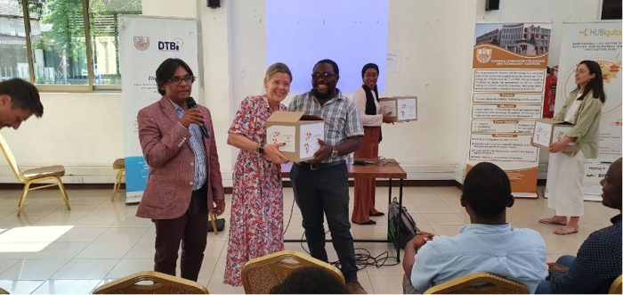

<!--  -->


## Waziup participated in HUBiquitous General Meeting in Tanzania, Showcases Innovative Solution

Waziup attended the HUBiquitous General meeting held in Dar es Salaam, on April 15, 2021 which lasted for three days and included plenaries, workshop and an external event organized by DTBi. During the event, the version 1 Solution lab kit box was distributed to the partners. The Solution lab is a physical infrastructure that provides a comprehensive range of technological resources, including  Waziup development kits, third party electronics and development board and sensor resources etc. These Solution Lab are developed by WAZIUP e.V. under the frame of HUBiquitous project. The solution Lab is designed to help partners accelerate their digital innovative initiative. The General meeting in Dar es Salaam was a huge success and we look forward to continuing working with the partners to drive digital transformation in the region.
