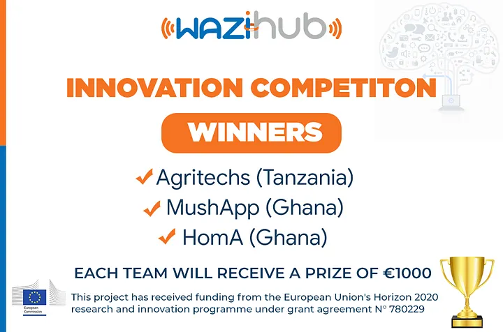

First IoT Prototyping competition to support IoT enthusiasts learn and bring to life innovative prototypes with the help of our trainers and the WAZIUP technology (software and hardwares). 
The competition was implemented in 6 African countries in collaboration with distinguished tech hubs, partners of the project namely: Kumasi Hive in Ghana, iLabAfrica in Kenya, SONATEL in Senegal, The MakerSpace Foundation in South Africa, Hive Colab in Uganda and DTBi in Tanzania.
“WAZIHUB vision is to foster IoT deployment in Africa, engaging startups and entrepreneurs for rapid prototyping with the Open Source low-cost WAZIUP IoT LoRa technologies” Says Dr.-Ing. Abdur Rahim, WAZIHUB Project Coordinator.
The total number of Internet of Things (IoT) connected devices is projected to be 21.5 billion units worldwide by 2025. In this revolution, the African continent has the potential to fulfill the promises and challenges brought by the IoT.

<!--  -->


However, the continent needs drivers, people with the expertise and the will to bring out IoT innovations from young entrepreneurs, engineers and developers to improve the living and working conditions in Africa.

The WAZIHUB [www.wazihub.com](http://www.wazihub.com/) project aims at enabling startups and entrepreneurs to innovate and build low-cost IoT prototypes using the WAZIUP (www.waziup.org) technology. Fully funded by the European Commission for 3 years, WAZIHUB main objective is to empower affordable and open IoT solution adoption in Africa. The project consortium is formed by 10 African partners and 4 European partners and provides free capacity building and low-cost end-to-end technology.
With that objective in mind, the project launched its first Innovation Competition in 6 countries: Kenya, Ghana, Senegal, Tanzania, Uganda and South Africa. The objective was to give the opportunity to young Africans to build innovative and effective IoT solutions. The competition duration was 3 months, and received full support from the tech hubs in the WAZIHUB Consortium.
A total of 117 applications were received (representing more than 400 entrepreneurs) and 31 teams were selected to join the competition.

The selected startups covered a range of sectors such as Agriculture and Farming, Construction, Covid-19 response, Security and Disaster prevention, Health, Smart city and Home automation, with vast potential to create positive change in their communities.
The enrolled teams have all made substantial progress towards developing their IoT prototypes and a good Web or Mobile App. They have built their first “Minimum Viable Product”, and teams worked with professional mentors to help them define a scalable business model.
When the competition ended, the results were announced and the top 3 projects were reviewed from the 16 finalists. "The finalists received €1000 in cash prizes each and are currently benefiting from continuous support and promotion from the consortium."

[Agritechs](https://www.agritechs.co.tz/) SMART HYDROPONICS, a solution using a combination of soilless farming (hydroponics) and the Internet of Things that makes Climate Smart Agriculture affordable, profitable and convenient, at both household and commercial scales
Watch their demo video [here](https://youtu.be/BYFSA_Pu--4)

MushApp, an IoT device used to monitor and automate mushroom farmers processes, using mobile app to make information accessible to the farmers
Watch their demo video [here](https://www.youtube.com/watch?v=jxheCUomYik&t=2s)

HomA, a system that makes the user aware of the internal conditions of the user’s Home. Displays air quality, occupancy states, allows remote control of appliances and alerts users in cases of theft , gas leakage or fire outbreak
Watch their demo video [here](https://www.youtube.com/watch?v=6JPTCSQg46Q&t=2s)
