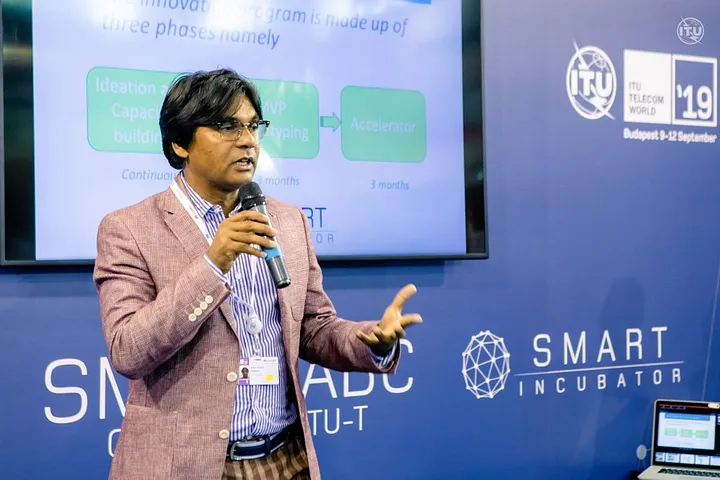

<!--  -->
<!--  -->


WAZIHUB and WAZIUP, recently participated in the ITU Telecom World 2019 event held in Budapest, Hungary. This annual international platform brought together influential figures from government, industry, and tech SMEs to connect, exhibit, explore common challenges, share ideas, and build partnerships.
Representing WAZIHUB were Prof. Dr. Congduc Pham from the University of Pau in the LIUPPA laboratory and Dr. Ing. Abdur Rahim, Coordinator of the project. During the event, Dr. Rahim participated in two panels: "From local to global innovation: The role of start-ups in standardization and market orientation for emerging technologies" and "5G testbeds: Laying the groundwork for smart cities." Additionally, Prof. Pham and Dr. Rahim gave a Smart Talk on "The Internet of Things in Africa" at the ITU Smart ABC pavilion.

The WAZIHUB team also set up a demo stand on the Smart ABC pavilion, where they interacted with government representatives, tech and SMEs delegates, and visitors interested in their activities. Their booth received a significant number of visits, and even the Secretary-General of ITU, Houlin Zhao, and Director of ITU Telecommunication Standardization Bureau, Chaesub Lee, stopped by to see their demonstrations.
WAZIHUB's and WAZIUP's participation at ITU Telecom World 2019 highlights their commitment to innovation and collaboration in the field of IoT. The aim is to provide affordable access to IoT technologies and support technology-oriented startups in Africa.
