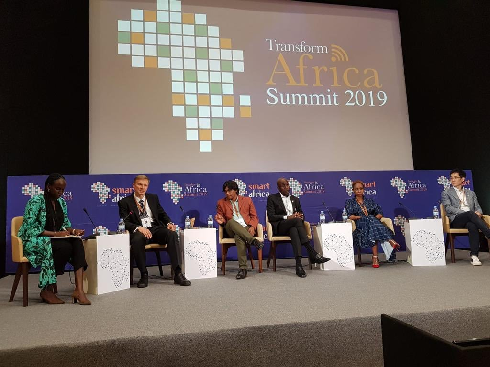

<!--  -->


Waziup was recently invited by Alexander NTOKO and Jonu UM, both representatives of the International Telecommunication Union (ITU), to participate in the prestigious ITU Telecom world event held in September 2018. At the event, Waziup showcased its innovative technologies and approach at the ITU’s Smart ABC Pavilion, and also organized a workshop where its delegates. 
Dr. -Ing. Abdur Rahim, Dr. Congduc Pham and Fiifi Baidoo gave presentations on IoT for sustainable development in Africa, deploying low-cost. Long-range IoT for rural and remote areas in Africa, and waziup’s open data platform for rural IoT applications. 
Additionally, Waziup delegates were invited to participate as expert panelists in two roundtables, which focused on ‘Smart Cities, Innovations in Sustainable Urban living’ and ‘A New concept of Future - Powered cities.’ This allowed waziup to share its expertise and lessons learned from its use cases and pilots, which received great interest from the attendees.
During the event, Waziup also took the opportunity to meet with regulatory agencies and authorities from various African countries, including Botswana, Burundi, Cameroon, Egypt, Ghana, Kenya, Malawi, Mali, Mozambique, Nigeria, Rwanda, Senegal, Soudan, South Africa, Swaziland and Zimbabwe. 
