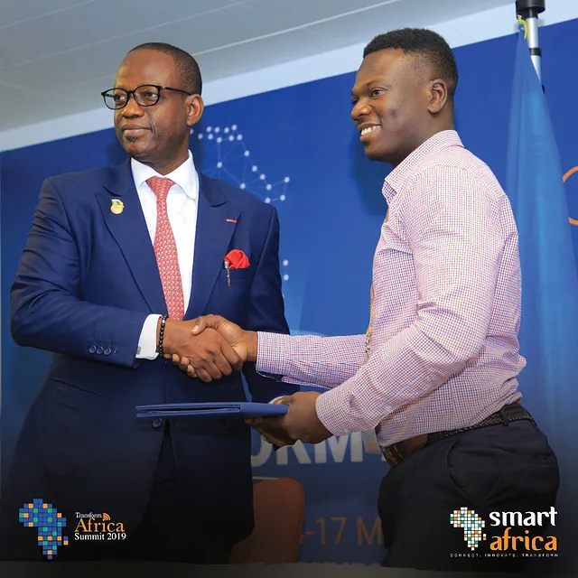

<!--  -->


The SMART Africa initiative, launched in 2013, is a commitment made by African leaders to accelerate socioeconomic development across the continent through the use of ICTs. Its goal is to harness the transformative power of technology to create a knowledge-based economy and enable African countries to compete in the global digital marketplace.
The MOU signed between Smart Africa and WAZIUP at the Transform Africa Summit 2019 aims to drive this agenda forward by supporting tech-oriented entrepreneurs and startups in Africa. Through this partnership, Smart Africa and WAZIUP seek to leverage their respective expertise and networks to provide startups with the resources they need to succeed.
Under the terms of the MOU, Smart Africa and WAZIUP will collaborate on a range of initiatives, including knowledge exchange, capacity building, and technical assistance for startups. By working together, they hope to create a more supportive environment for tech entrepreneurship in Africa, which will ultimately lead to the development of innovative products and services that address key socioeconomic challenges on the continent.
This partnership is particularly important given the rapid growth of the African tech startup ecosystem in recent years. Despite the many challenges facing entrepreneurs in the region, including limited access to funding, infrastructure, and markets, there is a growing sense of optimism about the potential of African startups to drive economic growth and social progress. By supporting these startups through initiatives like the Smart Africa-WAZIUP partnership, stakeholders across the continent can help to unlock this potential and build a more prosperous future for all Africans.
