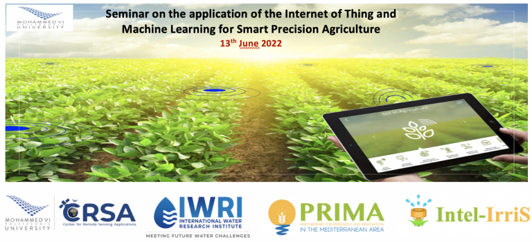

<!--  -->


## UPPA and Waziup launch - the embedded Intel - IrriS Irrigation WaziApp Application for smarter water usage

On June 13th, 2022, the International Water Research Institute (IWRI) of the University Mohammed 6 Polytechnic hosted a seminar on the application of the Internet of Things (IoT) and machine learning for smart precision agriculture. The seminar was organized by Pr K.Baraka and Pr J. Ezzahar of ENSA Safi and CRSA, and featured four guest speakers who shared their expertise on the topic. Two of the guest speakers were from Waziup e.V. 

Dr. -Ing. Abdur Rahim, Managing Director spoke about the challenges and perspectives of IoT edge computing for smart agriculture applications. Dr. Rahim emphasized the importance of using IoT edge computing in agriculture to improve efficiency and reduce costs, while also ensuring data privacy and security. 

Felix Markwordt, a Research and Development engineer at Waziup, gave a presentation on an IOT edge platform for AI applications in agriculture. Mr. Markwordt discussed how their platform uses machine learning algorithms to analyze data collected from sensors and cameras in the field, and how it can help farmers make informed decisions about crop management, irrigation and pest control.

The seminar was attended by researchers, students and industry professionals interested in the application of IoT and machine learning in agriculture. It provided an opportunity for participants to learn about the latest technologies and trends in smart precision agriculture, and to network with experts in the field. 

The organizers of the seminar expressed their gratitude to the guest speakers for sharing their knowledge and expertise, and to the IWRI for providing a platform for such important discussions. They also thanked the participants for their active engagement and interest in the topic.

Overall, the seminar was a great success, and it showcased the potential of IoT and machine learning in transforming the way we do agriculture.

