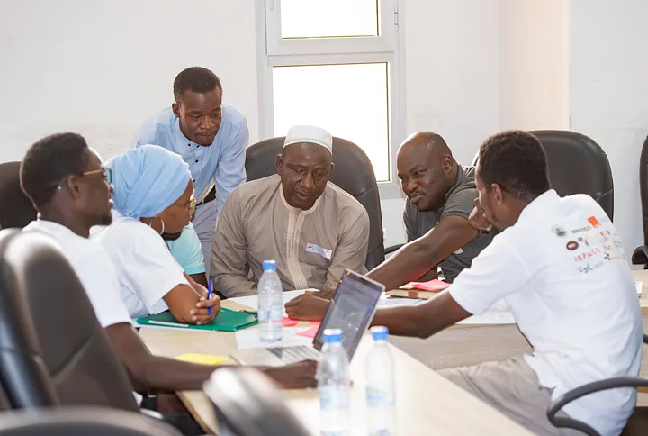

## Smart Village kickoff in Saint-Louis

With the objective of promoting innovation in Africa through IoT and Big Data, the partners have been engaging with entrepreneurs to develop solutions for both urban and rural areas
The WAZIHUB Smart Village is an initiative supported by three partners of the project namely the University Gaston Berger, SONATEL & Orange with the aim to deploy a large-scale testing site for solutions developed for the rural areas.
The University Gaston Berger had hosted this initiative and pilot activities since the kickoff which took place between 13 and 14 November 2019. The two days event was an opportunity to bring together the different stakeholders in the initiative of the smart village, to identify around the table the needs of end users.
Representatives of the Village of Sanar (where the university is located), head of the breeder’s associations, university admins and young tech enthusiasts (students of UGB) attended and participated in the two days workshop.

When the question **‘how can IoT solutions can be used in Senegal, participants shared their expectations  summarized in the points below’** :

**To improve productivity**

- The IoT in Senegal should make it possible to increase labour productivity, particularly in the agricultural sector and reduce the hardness of work.
- Fight pests invasion

**Facilitate prediction and anticipation**

- Help with the management of resources (water, stock …)
- Have more available data to better anticipate hazards
- Have better control of agriculture with collected data via sensors (temperature, humidity, climate change…)
- Provide advices

**Improve goods storage**

- Help with the conservation of productions
- To assist the marketing of goods and services
- Optimize the transport of goods
- With tracking, travel optimization to reduce costs and save time …

**Improve security**

- help merchants prevent or theft and fire of their stock
- IoT can also allow data to be retrieved in areas which are difficult to access

**From these points, local problems encountered by the local population where identified as are listed below :**

- the quality of the water (contamination),
- crop diseases,
- animal diseases,
- soil quality,
- transportations of products,
- conservation of productions,
- management of the spreading (including the quality of the inputs),
- cattle theft,
- the intrusion of fields by livestock,
- irrigation of the fields,
- living conditions of animals (temperature and ventilation of buildings, food, medicines …)
- health problems related to the use of phytosanitary products.

**Since all these issues could not be dealt within the workshop, a vote of participants allowed to identify these four problems with the highest interest:**

- Cattle theft
- Irrigation of the fields
- Soil quality
- Crop disease

The management and deployment of the infrastructures has been defined and teams are meeting regularly to share ideas, receive capacity building on Waziup LoRa devices to build the prototypes of the solutions.
