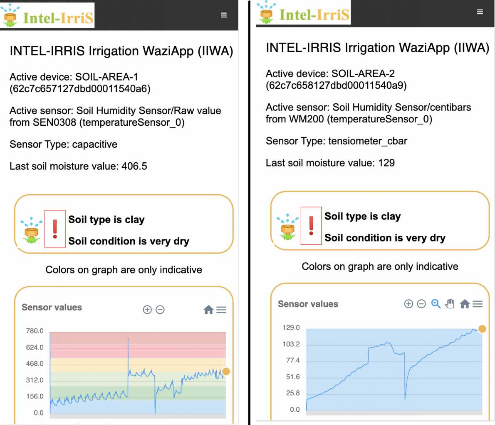

<!--  -->



## UPPA and Waziup launch - the embedded Intel - IrriS Irrigation WaziApp Application for smarter water usage

UPPA and Waziup have jointly developed the embedded Intel - IrriS Irrigation WaziApp Application (IIWA), which is now available for testing! The latest Intel - IrriS WaziGate SD card image includes IIWA, making it even easier for users to access and utilize the application.

With sensor calibration and agronomic/agriculture knowledge, IIWA provides more accurate irrigation notifications by taking into account factors such as sensor type, soil type, and plant type to calibrate low-cost soil humidity sensors. This can help farmers make better decisions about when and how much to water their crops, leading to improved yields and reduced water usage.

We are thrilled to be a part of this development and look forward to seeing how it can improve irrigation practices around the world.