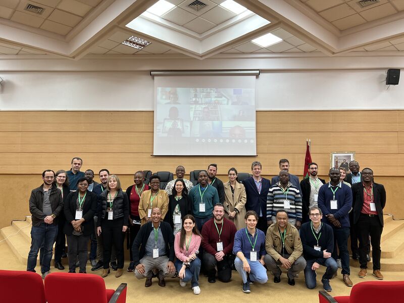

<!--  -->


## WAZIUP participate in Urbane consortium meeting in Rabat, Morocco

We are thrilled to share that Dr. -Ing. Corentin Dupont was part of the two - day hybrid meeting in Rabat, Morocco that marked the six month milestone of the Urbane Project. The meeting was hosted by IAV, a consortium partner of Urbane, the meeting provided a valuable opportunity for the project partners to meet in person and discuss the way forward for the project. 
During the meeting, each work package was presented by its work package leader and the upcoming six-month plan was communicated, providing an opportunity for the partners to explore ways to enhance collaboration among themselves. Dr. -Ing. Corentin Dupont also gave a presentation about the progress of the work package, and sharing valuable insights with the consortium.
