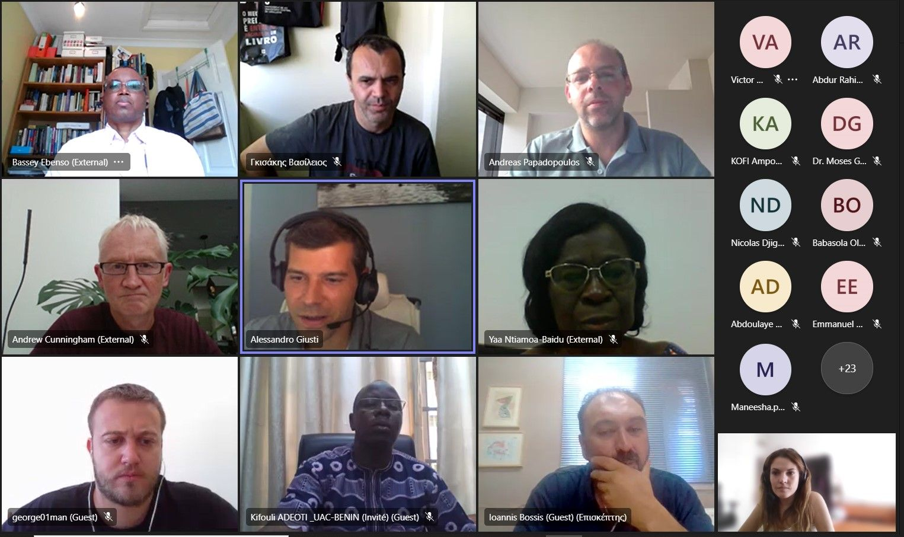

We are excited to announce that WAZIUP e.V. is a part of an innovative new project called ‘Urbane’. URBANE will explore the links between farming practices and health as it applies a One Health approach for tackling issues related to the application & intensification of peri-urban agriculture and the health of animals, humans and the ecosystem as a whole.
The first kick - off meeting for the project was held on the 26th and 27th of July 2022, bringing together project partners from across the globe to discuss the goals and objectives of the project. Waziup is proud to be one of the consortium partners in this project and will be contributing its expertise in IoT and cloud computing to help achieve the project’s aims.
Over the two days of the meeting, the partners introduced themselves and discussed various aspects of the project, including the technical and organizational requirements, as well as the expected outcomes. The meeting was a great success, and the partners left feeling optimistic and enthusiastic about the project’s potential.
Waziup is excited to be a part of this project and looks forward to contributing to the development of cutting-edge technologies that will transform the agricultural industry.
