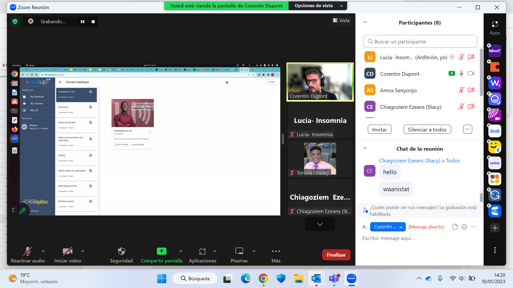

## Waziup’s WaziLab Simplifies Prototyping for African Startups in HUBiquitous Accelerator Program

HUBiquitous is on a mission to establish and empower Digital Innovation Hubs(DIHs) and TechHubs in five African countries, aiming to enhance their technological capacities and business development capabilities. One of the initiatives under this project is the HUBiquitous Accelerator Program, which aims to assist African entrepreneurs and startups in creating innovative products, services and applications. The program provides technical and business support to enhance their skills and expertise. To facilitate this acceleration program, HUBiquitous employs a learning platform called WAZILAB, which is designed and managed by WAZIUP. WaziLab is an IoT - based learning platform that simplifies the prototyping process for startups by offering better hardware accessibility, IoT capacity building, guided prototyping, and initial business support. It includes online courses, live prototyping, and solution building capabilities. More updates on the Learning center will be available soon. 