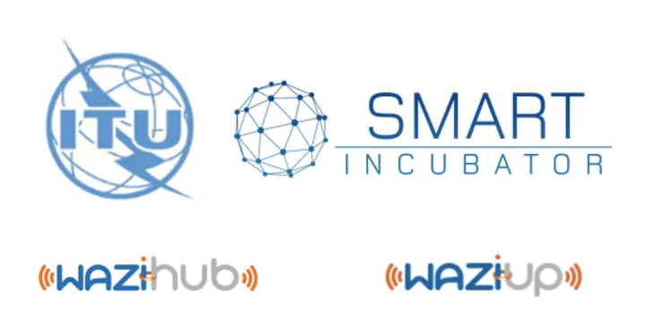

The World Summit on the Information Society (WSIS) Forum recently hosted a practical workshop on how to design and deploy low-cost IoT solutions across Africa. The workshop, titled "Internet of Things - From idea to reality, making it happen in Africa," was jointly organized by the International Telecommunication Union Smart Incubator, WAZIUP, and WAZIHUB.
This hands-on workshop brought together a panel of experts from various organizations, including Innocent Bagamba Muhizi, CEO of Rwanda Information Society Authority, Andrew Rugege, Director of ITU Regional Office for Africa, and Alexander Ntoko, Chief Operations and Planning Department TSB ITU. In addition, workshop leaders from Waziup and Wazihub, such as Congduc Pham, Abdur Rahim, Fiifi Baidoo, and Philippe Cousin, were present.
The workshop focused on user needs-driven innovation in IoT and featured training programs and demos of real use cases of IoT deployment in Africa. Under the umbrella of the ITU Smart Incubator program, which supports technology-oriented startups in the fields of AI, IoT, and Blockchain, this workshop aimed to foster knowledge exchange, share best practices, and identify emerging trends while promoting partnerships and advancing Sustainable Development Goals (SDGs).



Overall, this event represented an important opportunity for the global "ICT for development" community to come together and work towards achieving a more sustainable and connected world.