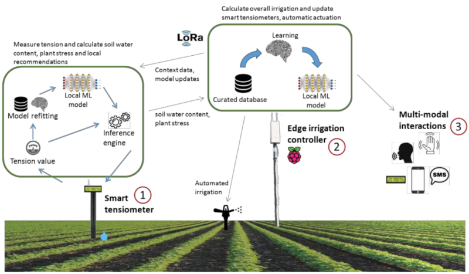

<!-- ## Precision Irrigation with Cost-effective and Autonomic IoT Devices using Artificial Intelligence at the Edge -->



Objectives
$$$

## Objectives

The following are the objectives for the OSIRRIS irrigation platform.

- Develop the "OSIRRIS irrigation platform" integrating IoT and AI with Edge computing architecture.
- Design a distributed AI model capable of running at both sensor and edge levels for autonomous irrigation.
- Create the "Smart Tensiometer," an embedded sensor system for automatic calculation of soil water content and plant water stress.
- Implement the Edge irrigation controller as an AI-enabled IoT gateway for computing and enacting irrigation schedules.
- Research and develop a "multimodal" user interface for improved user experience.
- Utilize open and affordable hardware such as Raspberry Pi and specialized micro-controllers for AI.



- Integrate solar power management for full energy autonomy.
- Enable local access to the irrigation application by using the Edge irrigation controller as a hotspot, eliminating the need for a permanent internet connection.
- Ensure data privacy by design and use the LoRaWAN radio protocol for communication.
- Deploy the OSIRRIS platform using the Edge-capable gateway developed by Waziup e.V.
- Employ a technical-economic approach to drive research activities, integrating hydraulic, agro-economic, technological, and environmental aspects.
- Pilot and validate the full system in four test sites in Tunisia, aiming to achieve a Technology Readiness Level (TRL) of 6-7.

---

Methodology
$$$
## Methodology

### Project Planning and Stakeholder Engagement

- Definition of project objectives, scope, and deliverables.
- Identification of stakeholders and establish communication channels.
- Development of a project timeline and budget.

### Research and Requirements Analysis:

- Conduct a comprehensive review of existing IoT and AI-based irrigation systems.
- Identification of technical requirements and challenges for the OSIRRIS platform.
- Defining user requirements through stakeholder consultations and market research.

### Hardware Selection and Prototyping:

- Evaluate open and affordable hardware options such as Raspberry Pi and specialized microcontrollers for AI.
- Develop prototypes of the Smart Tensiometer and Edge Irrigation Controller.
- Test hardware components for compatibility, reliability, and performance.

### AI Model Development:

- Research and develop lightweight AI models for soil water content and plant water stress estimation.
- Implement AI algorithms for automatic calibration and corrections.
- Validate AI models through simulation and real-world testing.

### Integration and System Development:

- Integrate AI models with the Smart Tensiometer and Edge Irrigation Controller hardware.
- Develop communication protocols for data exchange between components.
- Implement solar power management system for energy autonomy.
- Design and implement data privacy measures.

### User Interface Design and Development:

- Design a multimodal user interface for accessing and interacting with the OSIRRIS platform.
- Develop a mobile app, SMS notification system, and voice command interface.
- Conduct user testing and iterate on the design based on feedback.

### System Deployment and Testing:

- Deploy the OSIRRIS platform in operational environments at four test sites in Tunisia.
- Conduct pilot testing to evaluate system performance, reliability, and user acceptance.
- Gather feedback from end-users and stakeholders for further refinement.

### Validation and Documentation:

- Validate the technical-economic approach through performance metrics, including hydraulic and agro-economic performance and environmental impact.
- Document the validation process and results, including TRL assessment.
- Prepare user manuals, technical documentation, and deployment guides.

### Scaling and Commercialization:

- Develop a strategy for scaling up the deployment of the OSIRRIS platform to additional regions and users.
- Identify potential partnerships and funding opportunities for commercialization.
- Develop a marketing and dissemination plan to promote the adoption of the OSIRRIS platform.

### Monitoring and Maintenance:

- Implement a monitoring system to track the performance of deployed OSIRRIS systems.
- Provide ongoing maintenance and support to end-users.
- Continuously update the platform based on user feedback and technological advancements.

---

Pilot
$$$
## Pilot

In order to properly train the AI models, we will perform a data collection campaign. This campaign will use Waziup tensiometers together with commercial Tensiometers with dataloggers for the pilot.
The good management of the use of irrigation water and the conservation of water resources, especially in the context of the current global warming which enormously affects the southern part of the Mediterranean basin, which is one of the most important and urgent subjects for the community who is interested in the sustainability of resources. OSSIRIS will contribute to these efforts.

In addition, this new technology (OSSIRIS platform) allows farmers controlled, easy and precise the irrigation. In this context, the data collection is important to estimate the real needs of the plant, to fix a scheduling irrigation program and prepare the output data for OSSIRIS platform. OSSIRIS platform will provide an efficient use of irrigation water for each type of crop that saving water resource. Also, it will improve yield and fruit quality, assure food security. The pilot will be deployed in two sites each having two to five sensors per site.The duration for the pilot will be run for a duration of three to six months.

---

Results
$$$

## Results

### Year 2023 

- [WP 1 D1.1 Report on techno-economic analysis of the proposed irrigation solution.](deliverables/D1.1%20Report%20on%20techno-economic%20analysis%20of%20the%20proposed%20irrigation%20solution.pdf)

- [WP 1 D1.2 Recommendations for the design of the irrigation system]("./deliverables/D1.2 Recommendations for the design of the irrigation system.pdf")

- [WP2, WP3, WP4 D2.1 Analysis, architecture & design of the low cost AI-capable Smart Tensiometer]("./deliverables/D2.1 Analysis, architecture & design of the low cost AI-capable Smart Tensiometer.pdf")

- [WP2, WP3, WP4 D2.2 Report on the development of the low cost AI-capable Smart Tensiometer]("./deliverables/D2.2 Report on the development of the low cost AI-capable Smart Tensiometer.pdf")

- [WP2, WP3, WP4 D3.1 Design of the OSIRRIS light-weight AI irrigation model]("./deliverables/D3.1 Design of the OSIRRIS light-weight AI irrigation model.pdf")

- [WP2, WP3, WP4 D3.2. Report on the development of the OSIRRIS light-weight AI irrigation model]("./deliverables/D3.2. Report on the development of the OSIRRIS light-weight AI irrigation model.pdf")

### Detailed results

1. OSIRRIS Irrigation Platform - The main deliverable of the project will be the complete OSIRRIS irrigation platform, comprising the Smart Tensiometer, Edge Irrigation Controller, and associated AI models and inference engines.

2. Smart Tensiometer - A fully functional embedded sensor system capable of running lightweight AI models for automatic calculation of local soil water content and plant water stress. It will also include features for automatic calibration and corrections.

3. Edge Irrigation Controller - An AI-capable IoT gateway with an embedded AI model and inference engine capable of computing irrigation schedules and enacting them.

4. Multimodal User Interface - Development and implementation of a user interface that supports various modes of interaction including visual indicators on tensiometers, a mobile app, SMS notifications, and voice commands.

5. Hardware System Integration - Integration of the various components of the OSIRRIS platform onto open and affordable hardware systems such as Raspberry Pi and specialized microcontrollers for AI.

6. Solar Power Management System - Development and integration of a solar power management system to ensure the OSIRRIS platform's energy autonomy.

7. Deployment Toolkit - Development of a toolkit or guide for deploying the OSIRRIS platform, including instructions for setting up and configuring the system in various environments.

8. Pilot Testing in Tunisia - Pilot testing and validation of the full OSIRRIS system in four test sites in Tunisia, assessing its operational performance and effectiveness in real-world environments.

9. Technical-Economical Approach Documentation - Documentation outlining the technical-economic approach used in driving research activities on the irrigation system, integrating hydraulic and agro-economic performance, technological innovation, and environmental aspects.


