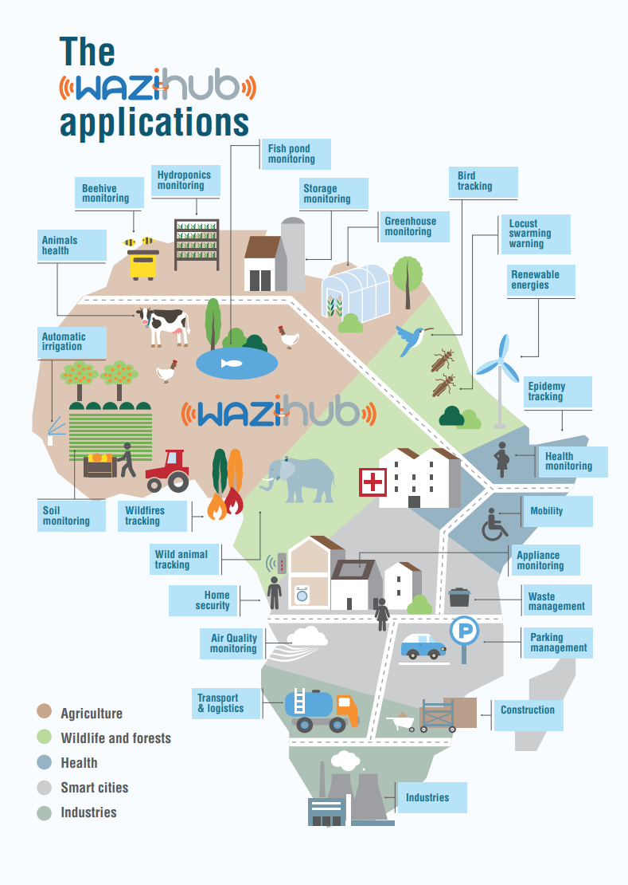

### Empowering Open Source and Affordable IoT Technologies in Africa

<!--  -->


IoT, or ‘Internet of Things’, is an on-going revolution that is changing the way innovation is being made around
the world. Startups, innovators and tech enthusiasts can now create their prototypes, with very little initial
investment. Africa is taking part of this IoT movement, and great innovation opportunities lie there.

Furthermore, more and more startups and companies need to transition from the analog setup of operations to smart seamless operations. The COVID-19 situation has caused many innovators, developers, and companies to return to the drawing board. They need to quickly hack together solutions to continue operations and reach their customers efficiently. The ability to manage processes remotely with higher impact is what most organisations in various sectors scratch their heads about.

The Waziup (in Swahili “Open-Up”) initiative funded by the European Commission under the H2020 framework program started in 2015 with a vision to offer fully open source Internet of things (IoT) technologies to African Tech Hubs, Start-ups and young communities (see page 11). The objective of this initiative is to provide a highly cost-effective and affordable IoT solution based on low power and long range LoRa communications. It is co-designed and co-developed by the African entrepreneurs in order to empower the social entrepreneurs and to foster the industrial IoT application.

The initiative expanded and enriched its activities under the H2020 WaziHub project. WaziHub’s target is to support, at large-scale, innovative users and usage of the Waziup technologies, with a goal towards sustainability and Pan-African impact of the proposed solutions. Our aim is to enable the creation of Open IoT Hubs throughout Africa where IoT technology solutions can then be adapted to match local serviceneeds.

Within WaziHub, we have organized more than 100 IoT training sessions, trained more than 1000 Africanyoung talents, distributed more than 200 IoT development kits, and supported 80+ startups to prototype their IoT solutions. WaziHub is building an African IoT open platform and ecosystem in collaboration with more than 10 TechHubs (see page 21).

We are thankful to the European Commission for funding this initiative and also our European and African partners, allowing us to realize this highly ambitious vision. I thank our Tech Hubs, startup communities for supporting us in realizing this vision. This initiative will transform into a new phase under European Commission funded project called HUBiquitous, in which we want to develop a joint European and African innovation ecosystem through the Tech Hubs network

### Related Contents

- Download [WaziHub Technology Magazine 2021](Wazihub_Technology_Magazine_2021.pdf).
