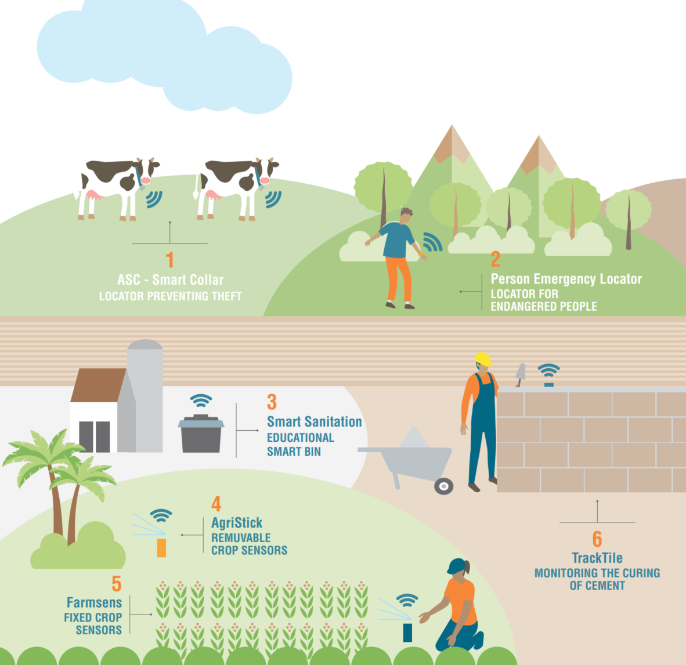

## Fostering IoT solutions for sustainable development in Africa

The first leg of our journey takes us to the African continent, in particular to the Sub-Saharan countries. In this developing part of the world there are many initiatives led by many NGOs, as well as public and private organisations with humanitarian objectives. They all have in common an interest and commitment towards accelerating the speed at which African countries can develop due to innovation and new technologies that improve people's’ lives while sustaining the economy.

The EU took part in this via the Joint Africa-EU Strategy; agreed upon as far back as December 2007, it is an overarching long-term framework for Africa-EU relations. The Strategy was adopted with a number of actions, one of
which resulted more recently in funding opportunities for joint projects within the H2020 Horizon framework program.

In this report we place our magnifying glass over two related projects WAZIUP and WAZIHUB. WAZIUP, which started in
2016 and finished recently, laid the foundations for the implementation of an IoT-based open platform, mostly based on existing assets, which were the result of previously funded EU collaborations and were immersed in the African context. WAZIHUB started in 2018 and aims to exploit these assets through integration with home-grown innovation-related activities, until 2021.

This introduction is organised in two sections highlighting first the lessons Fostering IoT solutions for sustainable development in Africa learned with specific reference to technology deployment and second, illustrating the paths taken to foster home-grown innovation in the context of the presented EU-Africa projects.

“Project execution exposed us to many deployment challenges” explains Abdur Rahim, the project coordinator of both
initiatives as the first phase nears its conclusion.

Considering 70% of the world’s population live in developing countries, working to address real daily life problems in these contexts is quite stimulating. Rather than keeping it in the labs of participating partners, we deployed it in real application domains, common across many African countries’ rural areas, such as livestock farming, precision agriculture, logistics and storage as well as fresh water management.”

The WAZIUP project proposes a Do-It-Yourself (DIY) approach to problem solving, providing a list of hardware and
IoT components to be used as well as tutorials to empower the locals to easily and quickly create solutions to the
problems they face in their daily activities. Due to its low-cost and wide coverage, IoT allows unique opportunities for social inclusion and innovation.

### Related Contents

- Download: [Waziup Magazine 2019](WaziupMagazine.pdf).
